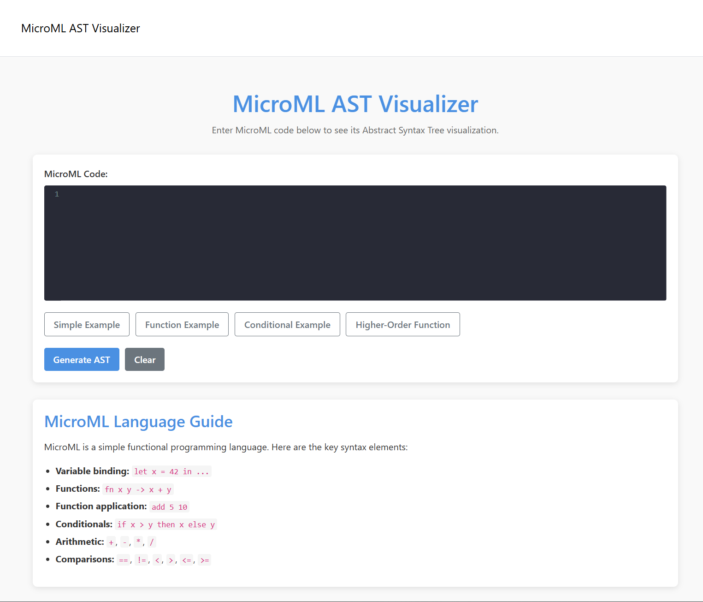
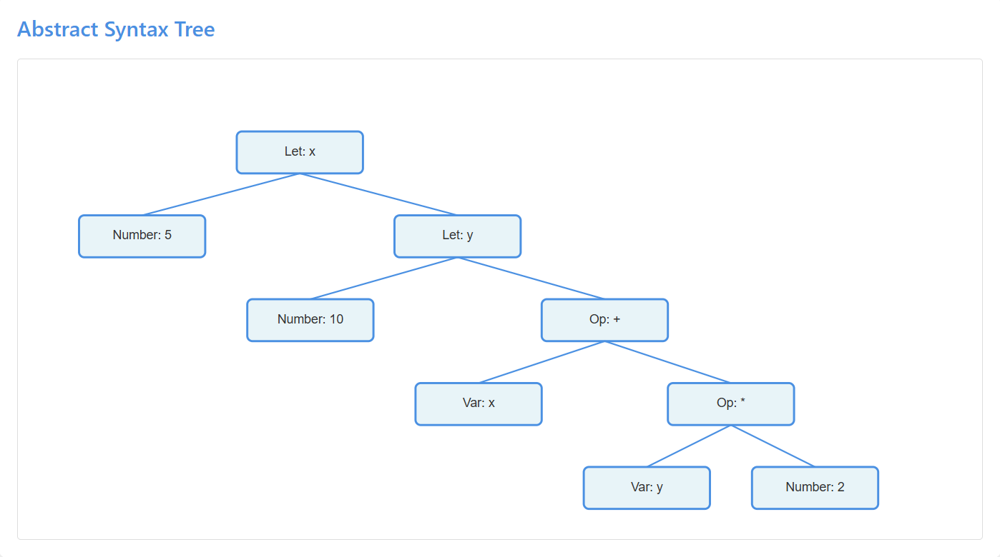
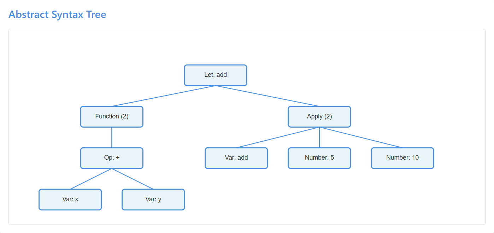
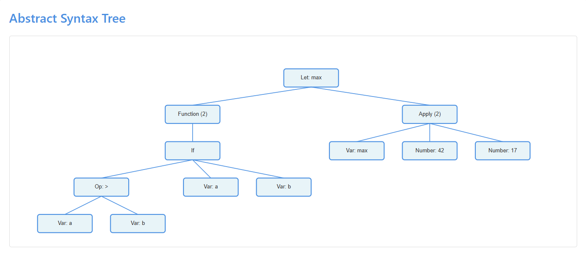
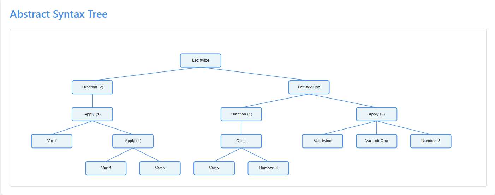
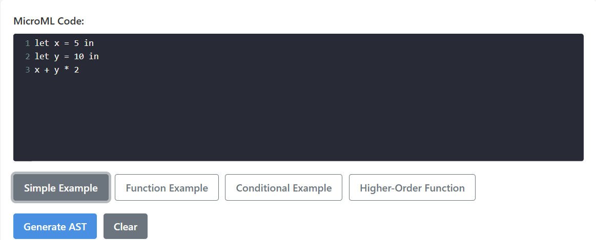
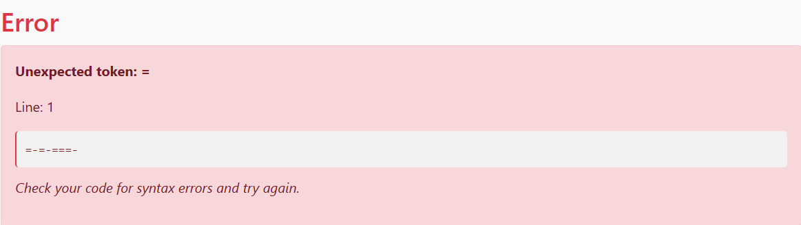

# MicroML AST Visualizer

A web application for parsing MicroML code and visualizing the resulting Abstract Syntax Tree (AST). This project was developed as part of CS 510.



## Features

- **Interactive Code Editor**: Syntax highlighting, line numbers, and auto-indentation for MicroML code
- **AST Visualization**: Clear, graphical representation of the Abstract Syntax Tree
- **Error Highlighting**: Visual feedback on syntax errors with line highlighting
- **Sample Code Examples**: Pre-loaded examples to demonstrate different MicroML features

## MicroML Language

MicroML is a simple functional programming language with the following features:

- **Variable Binding**: `let x = 5 in ...`
- **Functions**: `fn x y -> x + y`
- **Function Application**: `add 5 10`
- **Conditionals**: `if a > b then a else b`
- **Arithmetic Operations**: `+`, `-`, `*`, `/`
- **Comparison Operators**: `==`, `!=`, `<`, `>`, `<=`, `>=`
- **Higher-Order Functions**: Functions that take other functions as arguments

### Example: Simple Expression

```
let x = 5 in
let y = 10 in
x + y * 2
```



### Example: Function Definition and Application

```
let add = fn x y -> x + y in
add 5 10
```



### Example: Conditional Expression

```
let max = fn a b ->
  if a > b then
    a
  else
    b
in
max 42 17
```



### Example: Higher-Order Function

```
let twice = fn f x -> f (f x) in
let addOne = fn x -> x + 1 in
twice addOne 3
```



## Syntax Highlighting

The code editor includes full syntax highlighting for MicroML:

- Keywords (`let`, `in`, `if`, `then`, `else`, `fn`) are highlighted in blue
- Operators are highlighted in a distinct color
- Numbers and identifiers have their own styling
- Errors are highlighted in red



## Error Handling

When syntax errors are encountered, the application displays helpful error messages and highlights the line where the error occurred:



## Technologies Used

- **ASP.NET Core**: Backend web framework
- **C#**: Backend language for parsing and processing
- **CodeMirror**: Code editor with syntax highlighting
- **SVG**: For rendering the AST visualization
- **xUnit**: For unit testing

## Getting Started

### Prerequisites
- .NET 9.0 SDK or later
- Git

### Installation and Running

1. Clone the repository:
   ```
   git clone https://github.com/your-username/MicroML-AST-Visualizer.git
   cd MicroML-AST-Visualizer
   ```

2. Build and run the application:
   ```
   dotnet build
   dotnet run --project MicroMLParser
   ```

3. Open your browser and navigate to:
   - `https://localhost:5001` or
   - `http://localhost:5000`

## Development

### Project Structure

- `Models/`: Contains AST node definitions
- `Services/`: Contains the parser and AST renderer
- `Pages/`: Contains the web interface
- `wwwroot/`: Contains static assets (CSS, JS)
- `MicroMLParser.Tests/`: Contains unit tests

### Running Tests

```
dotnet test
```

## License

This project is licensed under the MIT License - see the LICENSE file for details.

## Acknowledgments

- This project was developed as part of CS 510
- Inspired by functional programming languages like ML and Haskell